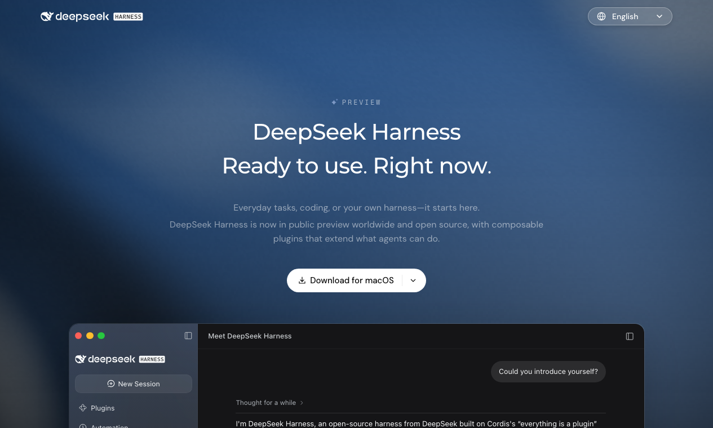
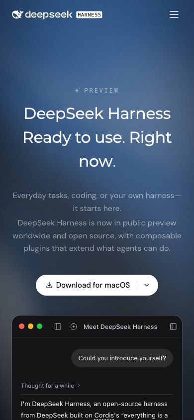

# DeepSeek Harness Website

[English](README.md) · 简体中文 · [日本語](README.ja.md)

这是 **DeepSeek Harness** 官网的独立复刻，包含桌面和移动端布局、动画演示，以及 26 个语言版本。

页面展示桌面工作区，以及插件、文件预览、定时任务和执行轨迹四组演示。阿拉伯语、希伯来语、波斯语和乌尔都语使用从右到左的布局。配套文档介绍网站的实现和测试方法。

- **动画演示**：支持手动暂停和减少动态效果设置。
- **页面操作**：切换语言、选择下载版本、复制命令。
- **26 个语言版本**：简繁中文、英语、日语、法语、德语、韩语、俄语、阿拉伯语、西班牙语、葡萄牙语、印尼语、土耳其语、波兰语、意大利语、乌克兰语、越南语、荷兰语、捷克语、罗马尼亚语、希伯来语、波斯语、泰语、印地语、孟加拉语和乌尔都语。
- **工程文档**：架构说明、实现示例、检查清单和源码练习。

[观看动画录屏](public/images/showcase-demos.webm) · [阅读官网工程案例](docs/zh/index.md) · [DeepSeek Harness 产品源码](https://github.com/deepseek-ai/deepseek-harness)

## 浏览与参与

GitHub Pages 根地址展示官网，工程文档位于 `/docs/`。本地运行和发布步骤见[开发指南](DEVELOPMENT.md)。

欢迎修复页面问题、改进无障碍体验、补充文档或审校译文。提交前可查看[贡献指南](CONTRIBUTING.md)、[安全报告](SECURITY.md)和[资源归属](NOTICE.md)。原创代码与文档采用 [MIT](LICENSE)。

本项目与 DeepSeek 无隶属关系。截图和录屏来自本仓库构建的网站。页面演示只用于展示；智能体运行或桌面应用的问题，请反馈到上游项目。
